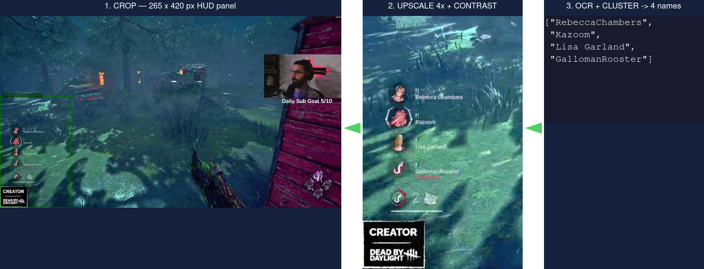
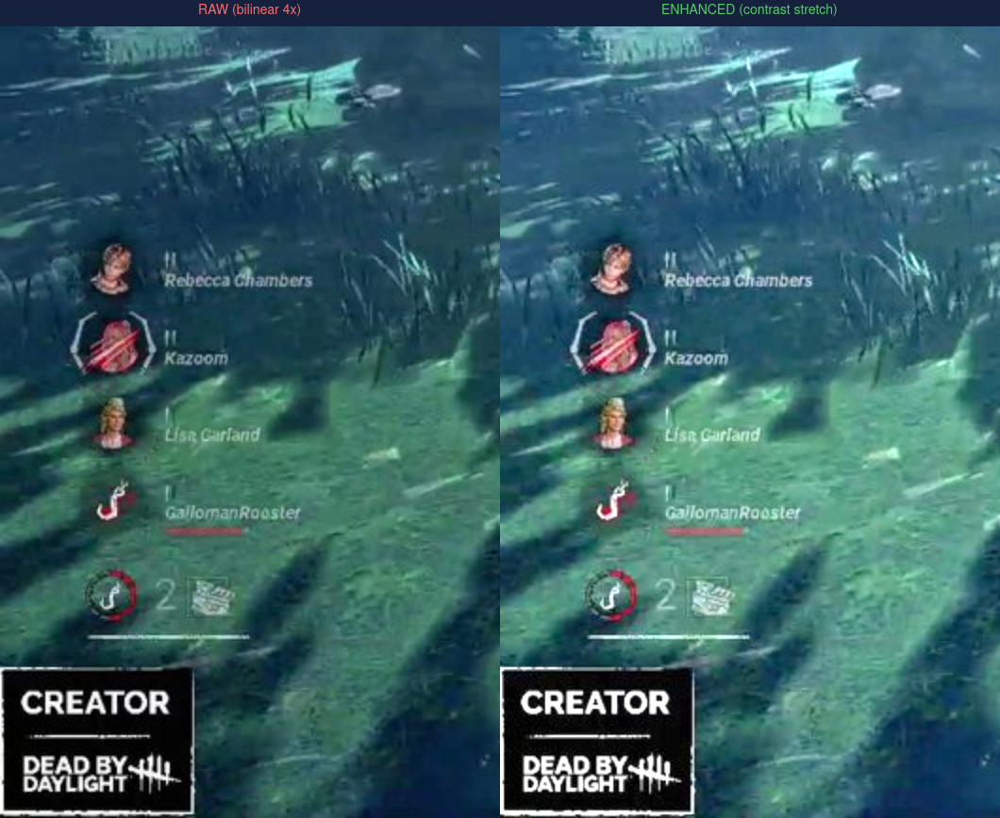
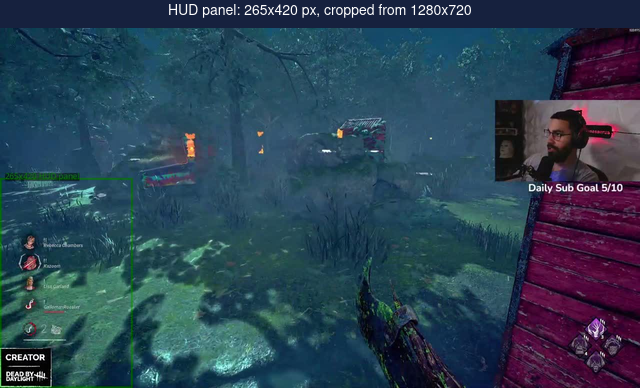

# hyperfocus2-ocr

Extracts **Dead by Daylight** survivor nicknames from 1280×720 stream-preview
screenshots. A lightweight FastAPI microservice that preloads a single
RapidOCR / PaddleOCR-ONNX engine at startup and answers one image per HTTP
request.



The pipeline crops the translucent HUD panel from the bottom-left corner,
upscales it 4× with bilinear interpolation, stretches contrast to make faint
white-on-dark names pop, then runs text detection (DBNet) and recognition
(CRNN) via ONNX Runtime. Overlapping detections are deduplicated and
greedily clustered into the four survivor rows.

**~0.12 s per image effective, 87% name accuracy.** 2500 screenshots in
~5 min on an 8-core CPU.

## Why this exists

| Approach | Load time | Per-image | Accuracy |
|---|---|---|---|
| tesseract + preprocessing | <1 s | ~2 s | Unusable on 14 px text |
| EasyOCR (PyTorch) | ~4 s | ~8.4 s | ~78% |
| **RapidOCR (ONNX)** | **~0.2 s** | **~0.15 s** | **87%** |

RapidOCR's lighter DBNet detector runs faster than EasyOCR's CRAFT on CPU,
and ONNX Runtime avoids the ~4 s PyTorch import. In-process OpenCV replaces
ffmpeg + ImageMagick subprocesses (~0.5 s savings per image). Bilinear
upscale beats Lanczos by ~5 pp — Lanczos ringing confuses the recogniser on
tiny glyphs.

## Quick start

```bash
# Install
python3 -m venv .venv && source .venv/bin/activate
pip install -r requirements.txt

# Run the server
OCR_THREADS=1 uvicorn app.server:app --host 0.0.0.0 --port 8081
```

```bash
# Docker
docker build -t hyperfocus2-ocr .
docker run -p 8081:8081 hyperfocus2-ocr
```

## API

### `POST /ocr`

Send a raw JPEG — get back the four survivor names.

```bash
curl -s --data-binary @preview.jpg \
     -H 'Content-Type: image/jpeg' \
     http://localhost:8081/ocr
```

```json
{"names": ["RebeccaChambers", "Kazoom", "Lisa Garland", "GallomanRooster"]}
```

| Status | Meaning |
|---|---|
| `200` | Names extracted |
| `400` | Empty body |
| `413` | Body exceeds `OCR_MAX_BYTES` (default 8 MiB) |
| `415` | Not a valid JPEG |
| `502` | Inference failure |

### `GET /healthz`

```json
{"status": "ok", "hybrid": true}
```

## Configuration

| Variable | Default | Description |
|---|---|---|
| `OCR_HOST` | `0.0.0.0` | Listen address |
| `OCR_PORT` | `8081` | Listen port |
| `OCR_THREADS` | `1` | ONNX intra-op threads |
| `OCR_HYBRID` | `true` | Hybrid mode (detect @ 1×, recognise @ 4×) |
| `OCR_MAX_BYTES` | `8388608` | Max request body (8 MiB) |
| `OCR_LOG_LEVEL` | `info` | `debug` / `info` / `warning` / `error` |

## Scaling

The ONNX session is not thread-safe — each process runs one engine behind an
`asyncio.Lock`. Scale by running **N containers** behind a load balancer:

```yaml
# docker-compose (sketch)
services:
  ocr:
    build: .
    deploy:
      replicas: 8
    labels:
      - "traefik.http.services.ocr.loadBalancer.server.port=8081"
  traefik:
    image: traefik:v3
    ports: ["8082:8082"]
    volumes: ["/var/run/docker.sock:/var/run/docker.sock:ro"]
```

Then point `hyperfocus2` at `http://traefik:8082`.

> 8 replicas on an 8-core CPU gives ~2× throughput (memory-bandwidth bound).
> A GPU (CUDA EP) would push this to ~10–30 s for 2500 images.

## Development & testing

```bash
# Accuracy report against labelled fixtures (testdata/*.json)
python -m app.fastocr --test

# Single image
python -m app.fastocr --json testdata/18.jpg

# Batch (parallel)
python -m app.fastocr --workers 8 --json testdata/*.jpg
```

Test fixtures live in `testdata/` — 18 labelled screenshots (`.jpg` + `.json`
pairs). Each `.json`:

```json
{"survivors": ["NameOne", "PlayerTTV", "ThirdName", "FourthName"]}
```

The accuracy harness uses edit distance with tolerance `max(2, len/5)`.

<details>
<summary>Per-image breakdown (hybrid mode, single process)</summary>

| Phase | Time |
|---|---|
| Crop + 4× bilinear + contrast | ~21 ms |
| Text detection (DBNet @ native) | ~65 ms |
| Text recognition (CRNN @ 4×) | ~60 ms |
| Dedup + cluster | <1 ms |
| **Total** | **~145 ms** |
</details>

## Contrast enhancement



The HUD panel is a translucent dark overlay — behind bright game areas the
white name text loses contrast. The in-process stretch (numpy `power` +
`clip`, emulating `magick -level 0,80%,1.15 -contrast`) recovers faint names
without artefacts that would confuse the recogniser.

## Crop area



Only the bottom-left 265×420 px panel is processed — the rest of the
1280×720 frame is discarded. Everything below 82% of panel height (ability-bar
numbers, watermark text) is filtered as noise.
